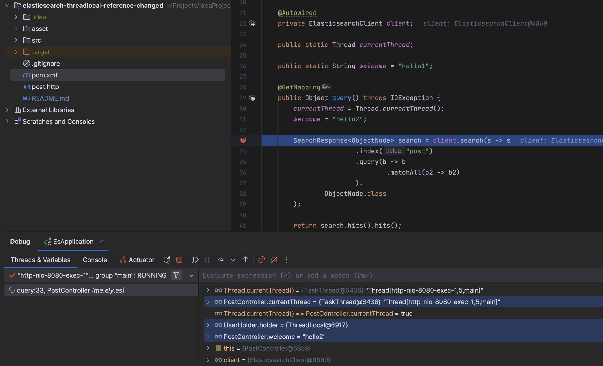
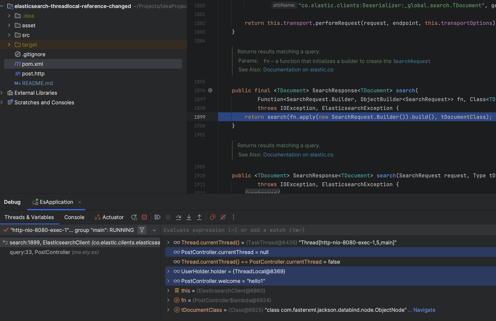

# elasticsearch-threadlocal-reference-changed


I have a class UserHolder, which has a ThreadLocal change
```java
public class UserHolder {

    public static ThreadLocal<String> holder = new ThreadLocal<>();

}
```

When I call the ElasticsearchClient.query method in the PostController class, the currentThread results are different before entering the query method and after entering the method
```java
@RestController
@RequestMapping("/api/post")
public class PostController {

    @Autowired
    private ElasticsearchClient client;

    public static Thread currentThread;

    public static String welcome = "hello1";

    @GetMapping
    public Object query() throws IOException {
        currentThread = Thread.currentThread();
        welcome = "hello2";

        SearchResponse<ObjectNode> search = client.search(s -> s
                        .index("post")
                        .query(b -> b
                                .matchAll(b2 -> b2)
                        ),
                ObjectNode.class
        );

        return search.hits().hits();
    }

}
```



